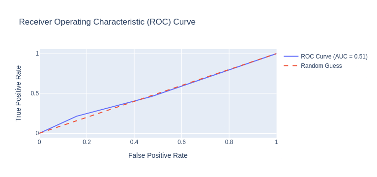

# Results (Tasks: 26,27,28)

# Impact of personal factors on re-hospitalisation

 In this section, the impact of personal factors on re-hospitalisation has been examined. The factors are grouped into 3 analyses:
 
- Age and Gender  
- Weight, Height, BMI  
- Education, Number of children, and Marital status  

### Target variables
Each group is analysed against 3 types of indications (targets) individually:  
- Time **between 1st and 2nd** hospitalisations only, categorical: `Short` (0 to 8 days), `Medium` (9 to 27 days), `Long` (28 days and more)  
- Time **between individual** hospitalisations, categorical: same as above  
- Time spent in **first** hospitalisation, categorical: Short (0 to 1 days), Medium (2 to 3 days), Long (4 days and more)  
- Time spent in **second** hospitalisation, categorical: same as above  

## Age and Gender

### Setting
- Target feature: each one of the 4 indications of duration classification above, individually.  
- Training features:   
	- **Age**, binned into 7 intervals: `65-69`, `70-74`, `75-79`, `80-84`, `85-89`, `90-94`, `95+`  This classification gives an even frequency of the 5 first age bins while retaining a variety in age groups for finding better classification relationships by the model.  
	- **Gender**: `male, female`      
- Data Split into 70% train 30% test.    
- Model - Neural Network Classifier    
    - Hidden size = 10        
    - Learning rate = 0.01  
    - Number of epochs = 5000  

Training loss vs epochs  

### Results
In all 4 target indications we observe a decrease in the training loss  for up to between 670 to 3200 epochs and then stabilising at around 1.08.  

|              | precision | recall | f1-score | support |
| ------------ | --------- | ------ | -------- | ------- |
| 0 (Long)     | 0.32      | 0.31   | 0.32     | 259     |
| 1 (Medium)   | 0.31      | 0.12   | 0.18     | 233     |
| 2 (Short)    | 0.33      | 0.53   | 0.41     | 259     |
| accuracy     |           |        | 0.33     | 751     |
| macro avg    | 0.32      | 0.32   | 0.30     | 751     |
| weighted avg | 0.32      | 0.33   | 0.31     | 751     |

**Table 1:** Model evaluation scores on the test set  
In all target indications we observe that all scores are very low 

The actual class distribution is relatively balanced, but there is a noticeable difference between the predicted class distribution and the actual one. The model tends to over-predict "Short" class instances while under-predicting "Medium" and "Long" classes. This is evident from the skew in the predicted distribution plot.  

From the confusion matrix for all target indications  we observe very similar result: overall accuracy fluctuates around only 32.8 - 39.3%, which for 3 categories is no better than random guessing.   

### Conclusions
There is no correlation between the **age** and **gender** of the patient and any of:  
- duration between the $1^{st}$ and $2^{nd}$ hospitalisations.   
- duration between hospitalisations above $2^{nd}$   
- $1^{st}$ hospitalisation duration.  
- $2^{nd}$ hospitalisation duration.  

## Weight, Height and Body Mass Index

### Setting
A similar setting to [Age and Gender](#Age%20and%20Gender) has been employed, with different...   

- predictor features:   
	- **Weight**, kg, integer   
	- **Height**, cm, integer   
	- **BMI**, integer   
- And Neural network classifier configuration:  
    - Hidden size = 2 Dense + 2 Dropout    
    - Learning rate = 0.00001  
    - Number of epochs = 100 with early stopping, patience=25  
   
### Results

Model performance for the loss looks good, and not over or under-fitted due to early-stopping, dropout, and adjusting the LR for Adam optimizer.  

However, the Accuracy doesn’t seem to rise and improve which indicates that there is no correlation between the variables.  

 

ROC curve also indicates that results are no better than random guessing.   

### Conclusions

In this workflow, we tried to classify `duration_classification` into three categories (`short`, `medium`, `long`) using features such as `Height`, `Weight`, and `BMI`. After building an initial model, the performance was unsatisfactory. We applied various strategies to improve the model’s learning capacity, such as:  
- Data normalisation.  
- Adding more complex layers (Batch Normalisation, Dropout).  
- Adjusting the learning rate and increasing the training epochs.  

Despite these enhancements, the model’s learning might still be inadequate. This suggests that there could be no strong correlation between physical attributes like `height`, `weight`, and `BMI` and the classification we are trying to predict.  

### Discussion: Why There Might Be No Correlation

The features (`Height`, `Weight`, `BMI`) are typically used for predicting health or fitness-related outcomes, but may not be relevant for categorising durations such as `short`, `medium`, or `long`. These duration classes might depend on factors outside of body measurements, such as behaviour, activity levels, or even external conditions that aren’t reflected in physical characteristics.  

In summary, it’s possible that the features provided are not significant predictors of the target variable, leading to poor model performance even with advanced techniques. we may need to explore other features that are more aligned with `duration_classification`.

## Education, number of children and marital status
### Preprocessing

- A thorough feature extraction was required for the General Data table   
	- Upon examination of the contents of the  'Education' column, it was determined that the column does not  actually contain information about education, but about occupation of the person. The information is expressed in the form of short free-form text description of a person's occupation. As the dataset only concerns patients of the golden age, most of the records indicate person's past occupation, along with words indicating retired/not working/disabled status. (ex. "retired, formerly an accountant")  
	- We could not assume that lack of 'retired' status meant the person is still working, rather that it just was not written down during the admission process. Therefore, we decided to ignore the pensioner status.   
	- Regarding the past occupation, being a free-form text, this column required some NLP analysis to convert into a categorical feature. We chose to convert the occupations into 22 [NACE](https://en.wikipedia.org/wiki/Statistical_Classification_of_Economic_Activities_in_the_European_Community) categories.  
- Additionally the structure of hospitalisation history data had to be examined deeper.   
	- A considerable proportion of individual records were inflated due to duplicate structure of  the data. This had to be pre-processed as well.   

### Setting
A similar setting to [Age and Gender](#Age%20and%20Gender) has been employed as well, with different:  

- **predictor features:**  
	- **Occupation**, 22 categories (ex. Construction, Education, Retail, etc.)   
	- **Number of children**, integer   
	- **Marital status**, 5 categories: `married`, `divorced`, `widowed`, `single`, `separated`  

- **model selection** process on a comprehensive battery of models has been tried, each grid searched over a broad spectrum of hyper parameters   
	- The models include mostly **classical ML** models, such as Logistic Regression, Random Forest, Gradient Boosting, Support Vector Machine, XGBoost and a simple Neural Network among others.  
	- For each of the [hospitalisation duration indications](#Target%20variables), the best performing model was chosen based on accuracy.  

### Results
Even though, for different target indications, different model turned up best, none of the models achieved satisfactory results.   

None of the models reached above 40% accuracy  

Even though the actual class distribution is relatively balanced, the models tend to over-predict the Long duration class.   

### Conclusions
In spite of the thorough pre-processing and model selection, **no** significant impact of occupation, number of kids and marital status on hospitalisation duration was observed in any of the 3 indications.   
