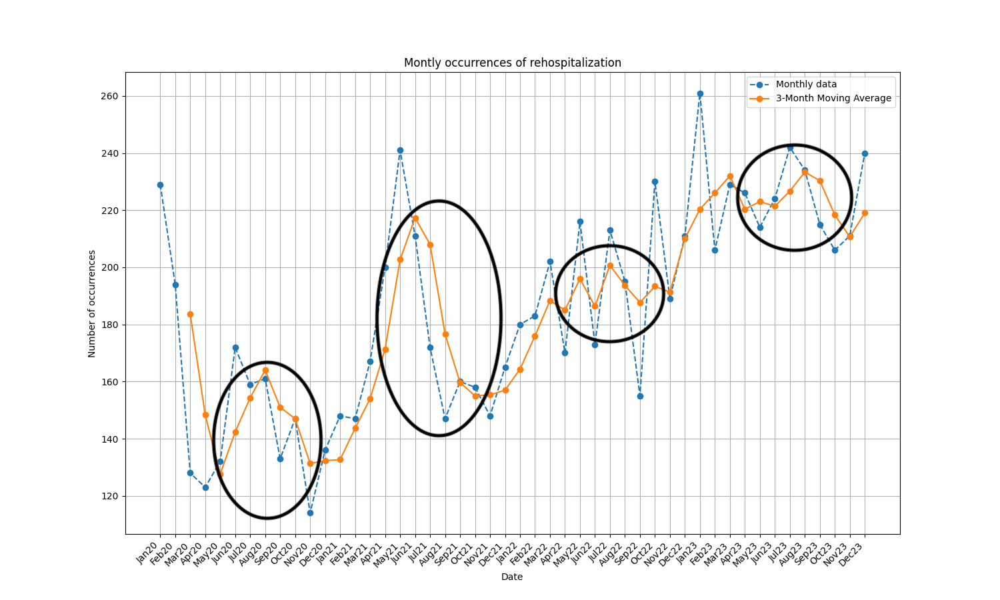

# Timeseries analysis
We have performed timeseries analysis on sheet `hospitalization2`, column `Admission_Entry_Date`.

Our initial attempts were to produce a graph on a *daily* and *weekly* basis. However, the line was mostly "jumping" up-and-down without any consistency and clarity.

Our next attempt was a plot on an *yearly* basis. It produced a sort of reverse effect, as there is only 3 years worth of data.

The final plot that can be seeing below and is on a *monthly* basis:

We have used 2 lines:
- Monthly number of rehospitalization occurrences
- 3-month average of rehospitalization occurrences

The former is a bit "jumpy". However, it shows a consistent increase of the overall rehospitalizations year by year.

The later illustrates further that number of rehospitalizations increases on average.  
In addition, we have identified that periods between `May` till `November` experience a sharp rise and sharp decrease compared to the rest of the months in a year. We have encircled such picks in black.

# Type of day analysis
Unfortunately, as discussed in `team_09_task_22.md` - there is no way to establish presence of statistical relationship between type of day and rehospitalization.  
Type of day (`workday`, `weekend`, `holiday`) and rehospitalization are both categorical variables.  
Tests that define presence of statistical relationship (such as Chi-Square) require a "contingency table".  
It can not be constructed because we have no data about patients who *did not rehospitalized* on a particular type of day.  

# Conclusion
A 100% bias towards rehospitalization exists and makes impossible to judge statistical relationship between type of day and rehospitalization.

There is a definitive increase, on average, in number of rehospitalizations per month.  
Period of `May` till `November` experiences a sharp increase and decrease in number of rehospitalizations.
